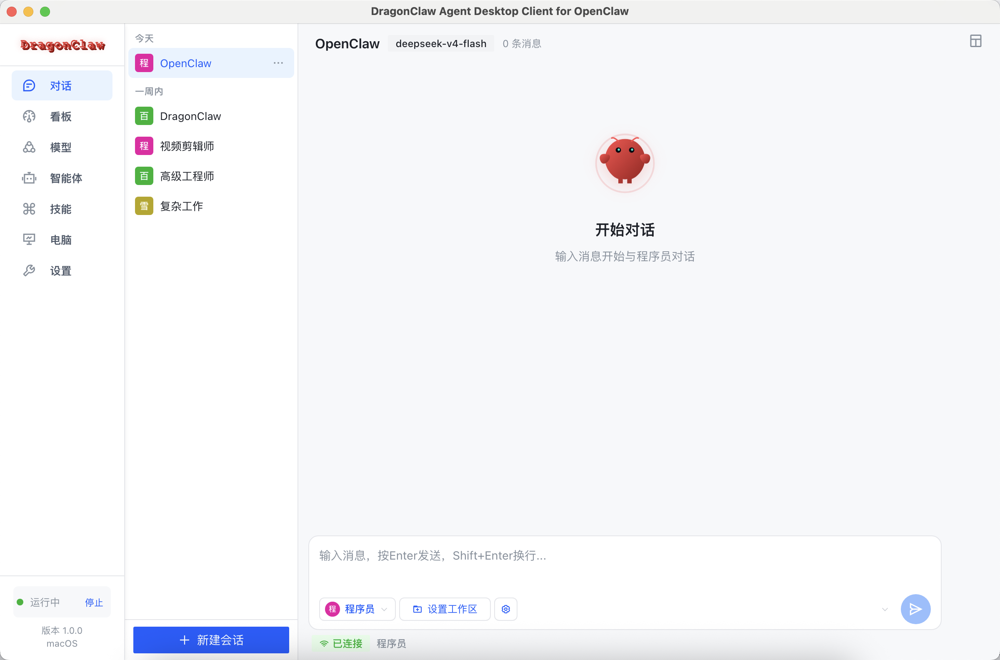
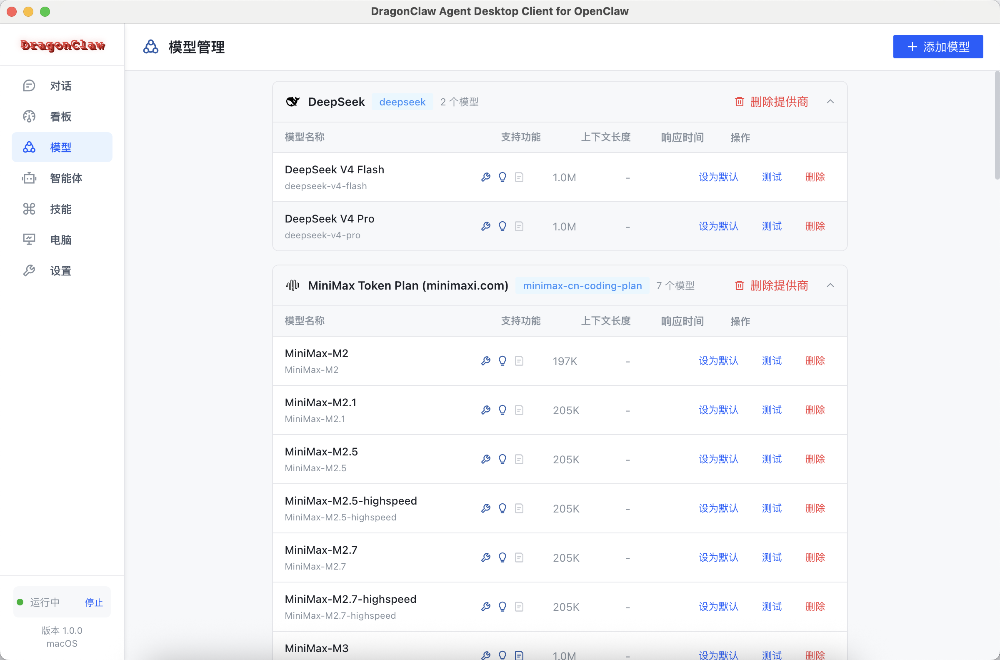
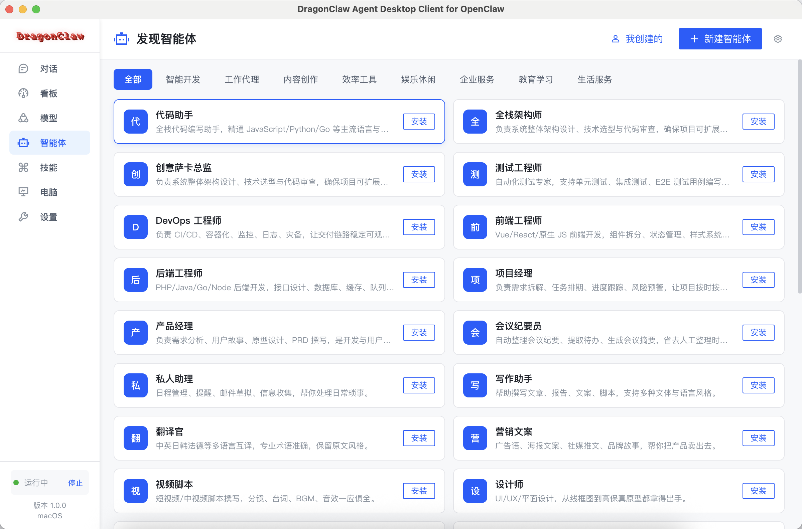
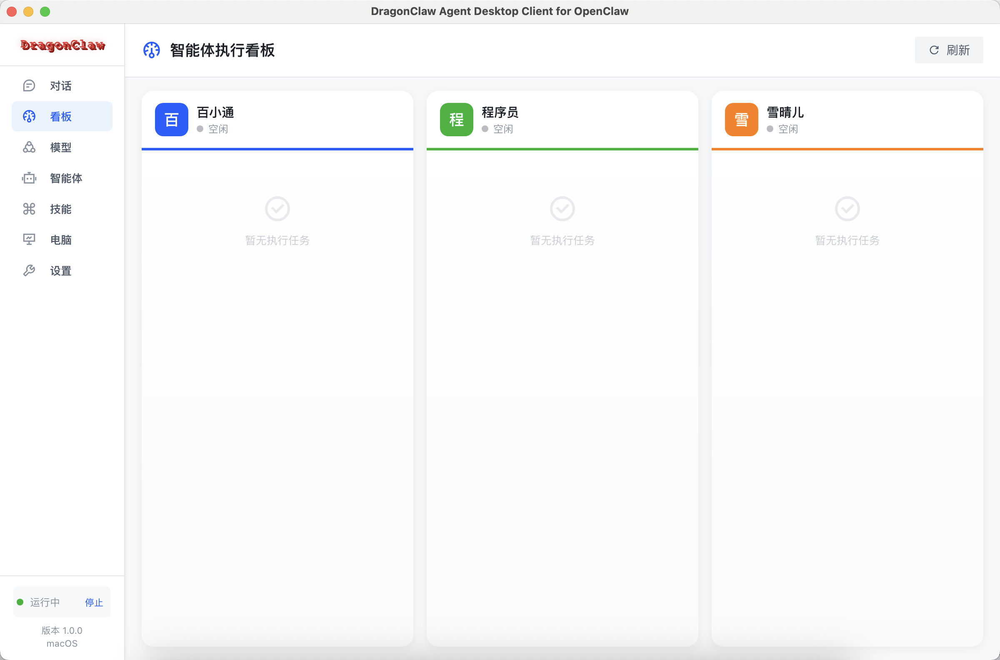
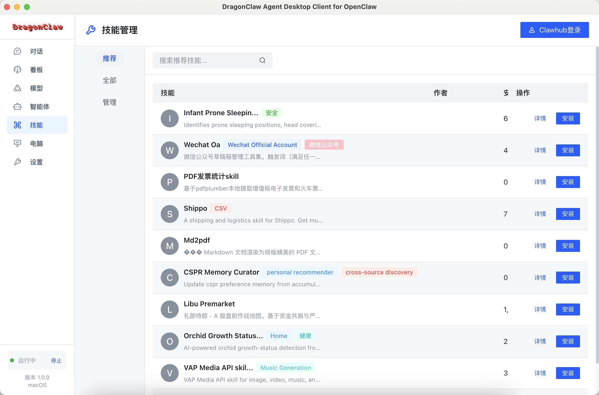
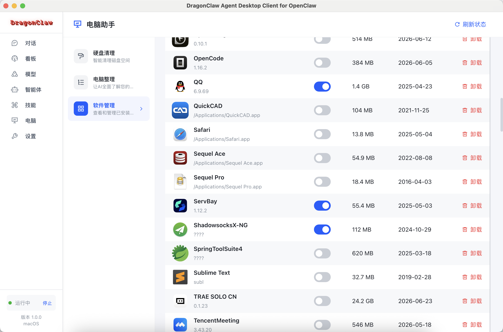
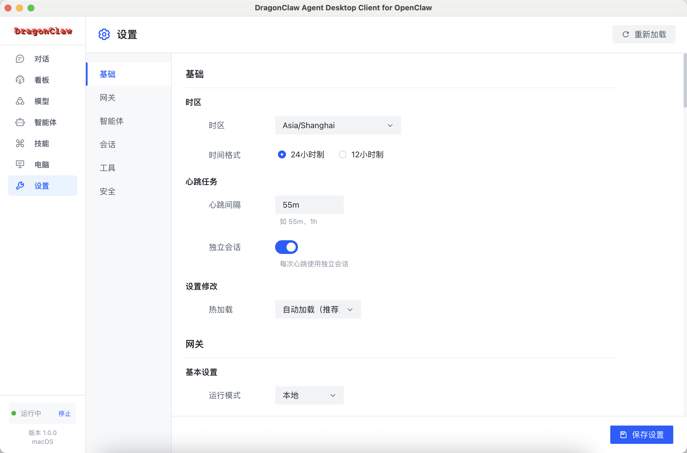

<div align="center">


# DragonClaw

**Возможно, лучший на сегодня десктопный клиент для OpenClaw — на Electron, Vue 3 и Vite.**

🌐 Официальный сайт: [http://www.dragonclaw.cc](http://www.dragonclaw.cc)

[](LICENSE)
[](https://www.electronjs.org/)
[](https://vuejs.org/)
[](https://vitejs.dev/)
[](https://www.typescriptlang.org/)

[English](README.md) · [简体中文](README.zh-CN.md) · [繁體中文](README.zh-TW.md) · [日本語](README.ja.md) · [Русский](README.ru.md) · [한국어](README.ko.md) · [العربية](README.ar.md) · [Deutsch](README.de.md)

</div>

---

## 📑 Содержание

- [🐉 О DragonClaw](#-о-dragonclaw)
- [🔍 Подробнее о функциях](#-подробнее-о-функциях)
- [🏗️ Архитектура](#%EF%B8%8F-архитектура)
- [✅ Требования](#-требования)
- [🚀 Быстрый старт](#-быстрый-старт)
- [🛠️ Скрипты](#%EF%B8%8F-скрипты)
- [📦 Сборка и релиз](#-сборка-и-релиз)
- [📁 Структура проекта](#-структура-проекта)
- [🧪 Тестирование](#-тестирование)
- [🗺️ Дорожная карта](#%EF%B8%8F-дорожная-карта)
- [🤝 Участие в разработке](#-участие-в-разработке)
- [📄 Лицензия](#-лицензия)
- [🙏 Благодарности](#-благодарности)
- [🌟 Star History](#-star-history)

---

## 🐉 О DragonClaw

**DragonClaw** — это целенаправленно разработанный десктопный клиент для [OpenClaw](https://example.com/openclaw), созданный поверх официального WebSocket API OpenClaw. Он построен на современном стеке **Electron + Vue 3 + Arco Design** и поставляется со всем необходимым окружением для работы OpenClaw — **установил и сразу работает**. Если OpenClaw уже установлен на вашей машине, DragonClaw обнаружит его и будет использовать автоматически — без затрат на миграцию.

DragonClaw — это не просто «графическая оболочка» для Gateway. Он привносит целый ряд **инновационных, продуктовых возможностей**:

- 🧠 **Управление агентами** — список, создание, обновление и удаление агентов; чтение/запись файлов рабочей области каждого агента.
- 🧩 **Центр навыков** — рекомендуемые навыки, поиск по всему каталогу, установка/удаление одним кликом.
- 💬 **Множественные диалоги** — параллельные сессии с умной группировкой, закреплением, метками непрочитанного и полной историей.
- 📁 **Рабочие области уровня сессии** — задание рабочей папки для текущей сессии прямо в окне диалога; все результаты работы OpenClaw остаются внутри этой области и не загрязняют остальное пространство.
- 🌳 **Подзадачи** — визуализация подзадач и подагентских сессий, порождённых основным агентом, в реальном времени.
- 📚 **Конфигурация моделей** — встроенная поддержка OpenAI, Anthropic, DeepSeek, Grok, OpenRouter, Groq, Moonshot, Alibaba, Ollama, ModelBus и пользовательских поставщиков.
- 🏪 **Agents Store** — подбор подходящих агентов онлайн и установка вместе с необходимыми им навыками одним кликом.
- 📋 **Канбан** — доска задач для организации работы между агентами.
- 📜 **Журналы** — потоковый просмотр логов Gateway прямо из приложения.
- ⚙️ **Единые настройки** — базовые, шлюз, агенты, сессии, инструменты и безопасность на одной панели.
- 🔄 **Обнаружение обновлений** — автоматическая проверка обновлений DragonClaw, OpenClaw, Node.js и др. при запуске.
- 🌐 **Удалённый доступ** — безопасное подключение к OpenClaw Gateway в локальной сети или на удалённом сервере по токену или паролю.

> 📖 Подробные описания функций (диалоги, рабочие области, подзадачи, конфигурация моделей, Agents Store, обнаружение обновлений, удалённый доступ) см. в разделе [🔍 Подробнее о функциях](#-подробнее-о-функциях) ниже.

---

## 🔍 Подробнее о функциях

Ниже — более детальный обзор ключевых возможностей DragonClaw и сценариев их применения.

### 💬 Диалоги (Conversation)

Панель диалогов — сердце DragonClaw. Это не простое окно чата, а полноценная **система совместной работы с множеством сессий**:

- **Параллельные сессии** — открывайте несколько диалогов одновременно, привязывая их к разным агентам или задачам. Переключение из боковой панели без перекрёстных помех.
- **Умная группировка** — исторические сессии автоматически организуются в группы *Сегодня*, *Вчера*, *На этой неделе*, *Ранее* — чисто и предсказуемо.
- **Закрепление и непрочитанные** — важные сессии можно закрепить; непрочитанные отмечаются красной точкой, чтобы ничто не потерялось.
- **Потоковый вывод** — ответы модели поступают в реальном времени, с параллельным отображением хода рассуждений и результатов вызова инструментов.
- **Прокрутка истории** — прокрутите к началу, чтобы лениво подгрузить более ранние сообщения; ничего не обрезается.
- **Действия с сообщениями** — копирование, цитирование, удаление и «сжатие» сессии доступны локально.
- **Уровень рассуждения** — выбирайте интенсивность мышления (высокий / средний / низкий) в верхней панели, балансируя задержку и качество.
- **Визуализация подзадач** — подзадачи и субагенты, инициированные основным агентом, отображаются компактными карточками внутри соответствующей группы сообщений — с указанием ответственного агента и актуального статуса.

#### 📁 Рабочие области уровня сессии (Session-level Workspace)

> **Рабочие области в DragonClaw задаются на уровне сессии и не загрязняют никакое другое пространство.** Каждой сессии можно назначить собственную рабочую папку прямо из окна диалога — все файлы, которые OpenClaw читает, пишет или создаёт внутри сессии, остаются внутри этой рабочей области и не «утекают» в другие каталоги или глобальное пространство.

Рабочая область привязывается к **текущей сессии**, а не к агенту глобально — две сессии с одним и тем же агентом могут использовать совершенно разные папки:

- **Настройка в окне диалога** — нажмите кнопку рабочей области в поле ввода, выберите папку, и она сразу же привязывается к активной сессии.
- **Область действия — сессия** — путь хранится в ключе сессии (`projectSpace`), поэтому при переключении сессий каждая показывает свою рабочую папку, а не общую глобальную.
- **Следующий контекст** — все операции чтения/записи файлов и запуска команд в этой сессии используют рабочую область как корень, поэтому агенту не приходится каждый раз спрашивать «куда сохранять?».
- **Открытие и перепривязка** — текущая рабочая область всегда видна в поле ввода; клик открывает её в системном файловом менеджере, либо можно в любой момент назначить новую.
- **Подсказка о пустом состоянии** — если рабочая область не задана, поле ввода подсвечивается, чтобы предотвратить ошибочные действия.



#### 🌳 Подзадачи (Sub-tasks)

Когда основной агент порождает подзадачи или субагентов, DragonClaw автоматически отслеживает их и представляет в двух взаимодополняющих видах:

- **Встроенный вид в сообщении** — карточки подзадач располагаются прямо под исходным сообщением с указанием агента-исполнителя, заголовка задачи и статуса.
- **Сводка в правой панели** — откройте правую панель, чтобы увидеть сразу все подзадачи текущей сессии и их состояние выполнения.
- **Синхронизация в реальном времени** — переходы состояний (pending → done) обновляются в реальном времени по мере получения событий от Gateway.

---

### 🧠 Конфигурация моделей (Model Configuration)

Конфигурация моделей — ещё одна область, где DragonClaw сияет. Там, где обычный OpenClaw заставляет вручную редактировать `config.json`, DragonClaw предлагает **полностью графический опыт управления моделями** и **поставляется со встроенной поддержкой всех основных поставщиков моделей**:

- **Основные поставщики встроены** — OpenAI, Anthropic, DeepSeek, Grok, OpenRouter, Groq, Moonshot, Alibaba, Ollama, ModelBus, а также полностью настраиваемый «Custom Provider» — всё преднастроено, никакой ручной доводки не требуется.
- **Единое управление множеством Provider** — десятки вендоров на одном экране; основную модель любой сессии можно переключить за секунды.
- **Группировка по Provider** — записи автоматически группируются по Provider с логотипом, количеством моделей и длиной контекста.
- **Богатые метаданные моделей** — данные из каталога `models.dev`: окно контекста, поддерживаемые возможности (инструменты, зрение, …), ценовой сегмент и др.
- **Визуальный CRUD** — добавление модели — это несколько полей (ID, отображаемое имя, макс. токенов…), JSON писать вручную не нужно.
- **Изоляция учётных данных** — API-ключи и BaseURL изолированы по Provider, не пересекаются между собой.
- **Локальные модели — полноценно** — Ollama преднастроена с `http://127.0.0.1:11434/v1`; локальные LLM работают прямо из коробки.
- **Переключение в рамках сессии** — меняйте основную модель диалога в его верхней панели без перезапуска Gateway.



---

### 🏪 Agents Store

> **Подбирайте подходящего агента онлайн и устанавливайте его вместе с необходимыми навыками одним кликом — больше не нужно вручную клонировать шаблоны из GitHub.**

DragonClaw поставляется со встроенным **Agents Store**, который позволяет просматривать и устанавливать агентов вместе с зависимыми навыками прямо из приложения:

- **Онлайн-каталог** — курируемый каталог официальных и комьюнити-агентов прямо в приложении.
- **Подберите подходящего агента** — фильтруйте по сценарию (разработка, писательство, офис, эксплуатация, …) и выбирайте того, кто лучше всего подходит под вашу задачу, а не довольствуйтесь тем, что уже установлено локально.
- **Установка агента и навыков одним кликом** — выберите целевого агента, и он установится вместе со всеми навыками, от которых зависит, — никакой возни с зависимостями вручную.
- **Локальная кастомизация** — установка полностью визуальна: аватар, ID, рабочая директория, описание персоны и т. д.
- **Представление «Мои агенты»** — отдельная вкладка со всем, что вы создали, доступная для редактирования, удаления и просмотра.
- **Онлайн-обновления** — когда у установленного агента выходит новая версия, обновитесь одним кликом.



---

### 🔄 Обнаружение обновлений (Update Detection)

DragonClaw включает **универсальный механизм обновления компонентов**, который **автоматически запускается при старте** и избавляет вас от сверки версий по разным экосистемам:

- **Автоматическая проверка при запуске** — при каждом старте DragonClaw одним запросом получает актуальные версии DragonClaw, OpenClaw, Node.js и др.
- **Подписанный источник** — обращение к эндпоинту `api.versionCheck` из `config.json` с идентификатором `sign=dragonclaw`.
- **Наглядные уведомления** — при наличии новой версии боковая панель и страница настроек показывают чёткое уведомление со ссылкой на changelog.
- **Загрузка и установка в приложении** — загрузка, установка и замена целиком из приложения, без блокировки главного окна.
- **Безопасный откат** — сбои загрузки или несоответствие подписей не повреждают существующую установку, экран не «белеет».

---

### 🌐 Удалённый доступ (Remote Access)

Независимо от того, где работает ваш OpenClaw Gateway — на другой машине в локальной сети или на удалённом сервере, внутреннем устройстве, домашнем NAS — DragonClaw подключается к нему гибко и безопасно по **токену** или **паролю**:

- **Переключение в один клик** — выберите «Удалённый режим» в меню или переключите его в боковой панели; подключение к нужному Gateway за секунды.
- **Гибкая аутентификация** — поддерживаются токен и пароль, что подходит под разные политики безопасности Gateway.
- **Индикатор состояния подключения** — в боковой панели в реальном времени отображается *Подключение / Подключено / Отключено*, есть кнопка ручного переподключения.
- **Идентичный локальному опыт** — после подключения все функции (агенты, сессии, навыки, настройки, логи…) работают ровно так же, как в локальном режиме.
- **Тест подключения** — до переключения можно проверить доступность целевого узла, чтобы не тратить время из-за неверной конфигурации.
- **Сохранение конфигурации** — удалённый адрес, порт и токен хранятся локально в зашифрованном виде и автоматически восстанавливаются при следующем запуске.

> 💡 Если у удалённого устройства нет публичного IP, сочетайте DragonClaw с Tailscale, ZeroTier, frp или другими решениями для туннелирования/NAT-traversal.

---

### 📋 Панель управления (Dashboard)

Когда задачу нужно разбить между несколькими агентами для параллельной работы, **Панель управления** DragonClaw выкладывает все задачи на одну доску:

- **Многоколоночный поток** — по колонке на каждого агента; задачи двигаются внутри своей колонки, а кросс-агентное взаимодействие видно сразу.
- **Обновление в реальном времени** — подзадачи и подагенты, созданные главным агентом, мгновенно отражаются в соответствующих карточках.
- **Визуализация состояний** — «простаивает», «выполняется», «ошибка», «готово» отображаются разными метками, чтобы узкие места сразу бросались в глаза.
- **Обновление одним кликом** — кнопка «Обновить» в шапке позволяет в любой момент подтянуть актуальное состояние, не дожидаясь push-уведомлений.



---

### 🧩 Управление навыками (Skill Management)

Экосистема навыков OpenClaw огромна — DragonClaw оборачивает её в **полностью графический центр навыков**, чтобы не приходилось править конфиги вручную:

- **Вкладки «Рекомендуемые / Все / Управление»** — переключайтесь между ними сверху: новички начинают с рекомендаций, опытные — ищут в полном каталоге.
- **Поиск по ключевым словам** — поле поиска фильтрует по именам и многоязычным тегам.
- **Установка/удаление одним кликом** — у каждой карточки навыка есть кнопка «Установить/Удалить»; откат и переустановка столь же легки.
- **Метаданные автора и обновлений** — список показывает автора, число установок и дату последнего обновления, чтобы оценить активность поддержки.
- **Синхронизация с локальным кэшем** — установленные навыки кэшируются локально, и при следующем запуске их не приходится скачивать заново.



---

### 🖥️ Ассистент компьютера (Computer Assistant)

Помимо работы с OpenClaw Gateway, DragonClaw включает модуль **Ассистент компьютера**, который приносит возможности AI на локальную машину:

- **Очистка диска** — интеллектуально сканирует большие файлы, кэши и то, что можно удалить, и подсказывает, сколько места можно освободить.
- **Упорядочивание компьютера** — AI получает целостную картину вашей машины и помогает сортировать и наводить порядок в файлах.
- **Управление ПО** — единый вид всех установленных приложений с сортировкой по размеру, дате обновления или объёму; ненужные приложения удаляются одним кликом.
- **Обновление состояния** — кнопка «Обновить состояние» в шапке запускает повторное сканирование машины и получает актуальные сведения о софте и железе.



---

### ⚙️ Единые настройки (Unified Settings)

DragonClaw собирает все настраиваемые параметры в единой **панели настроек**, чтобы конфиги больше не были разбросаны по разным файлам:

- **Основные** — часовой пояс, формат времени (24/12 часов), интервал heartbeat, изолированные сессии, горячая перезагрузка и прочее базовое поведение.
- **Шлюз** — режим работы (локальный/удалённый), адрес подключения, токен/пароль и прочие сведения для подключения к Gateway.
- **Агенты** — значения по умолчанию для агентов, шаблоны персоны, рабочая область по умолчанию.
- **Сессии** — политика хранения истории, порог сжатия сообщений, уровень рассуждения по умолчанию.
- **Инструменты** — переключатели возможностей подзадач, выполнения команд, чтения/записи файлов и т. д.
- **Безопасность** — аутентификация удалённого доступа, управление токенами, подтверждение чувствительных операций.
- **Сохранение и перезагрузка** — кнопка «Сохранить» внизу справа применяет изменения, «Перезагрузить» вверху справа отбрасывает правки и заново считывает значения.



---

## 🏗️ Архитектура

DragonClaw использует стандартную многопроцессную модель Electron:

```
┌──────────────────┐   preload/IPC    ┌──────────────────┐   WebSocket RPC   ┌──────────────┐
│     Renderer     │ ◀──────────────▶ │   Main Process   │ ◀───────────────▶ │   Gateway    │
│  Vue 3 + Vite    │   (contextBridge)│   Electron       │                   │   OpenClaw   │
│  Arco Design     │                  │   Node.js APIs   │                   │              │
└──────────────────┘                  └──────────────────┘                   └──────────────┘
         ▲                                       ▲
         │                                       │
    User Interface                       Native OS APIs
                                    (file system, dialogs, etc.)
```

- **Renderer** — Vue 3 SPA, собранный на Vite и Arco Design Vue.
- **Main** — главный процесс Electron, отвечающий за окна, IPC-обработчики и интеграцию с ОС.
- **Preload** — тонкий слой `contextBridge`, предоставляющий рендереру минимальный типизированный API.
- **Gateway** — процесс OpenClaw Gateway, доступный по WebSocket RPC.

---

## ✅ Требования

Перед началом убедитесь, что на вашей машине установлено:

| Tool | Version | Notes |
| --- | --- | --- |
| Node.js | `>= 22` | LTS recommended |
| Package manager | `pnpm >= 8`, `npm >= 9` или `yarn >= 1.22` | поддерживаются все три; рекомендуется `pnpm` |
| OpenClaw Gateway | `>= 2026.04.16` (минимальная поддерживаемая версия) | local or remote; the client connects via WebSocket |

---

## 🚀 Быстрый старт

### 1. Клонирование репозитория

```bash
git clone https://github.com/<your-org>/dragonclaw.git
cd dragonclaw
```

### 2. Установка зависимостей

```bash
# Recommended
pnpm install

# Or with npm
npm install

# Or with yarn
yarn install
```

### 3. Запуск в режиме разработки

```bash
pnpm electron:dev
```

> Эта команда одновременно запускает Vite dev-сервер (`:5177`) и окно Electron.

### 4. Сборка production-версии

```bash
# Сборка под текущую платформу
pnpm dist

# Сборка Windows-клиента
pnpm build:win

# Сборка macOS-клиента
pnpm build:mac

# Сборка Linux-клиента
pnpm build:linux

# Сборка клиентов сразу для трёх платформ
pnpm build:all
```

### 5. Собрать **все** установщики, которые способен породить текущий хост

`pnpm build:all` запускает [`scripts/build-all.mjs`](scripts/build-all.mjs) —
небольшой скрипт, который подбирает правильный набор целей под ОС хоста,
чтобы не вспоминать каждый раз нужные флаги архитектуры.

| ОС хоста | Что собирается |
| --- | --- |
| macOS | `mac-arm64.dmg` + `mac-x64.dmg` + `mac-universal.dmg` |
| Linux | `linux-x64.AppImage` + `linux-arm64.AppImage` + `linux-x64.deb` |
| Windows | `win-x64.exe` (NSIS-установщик) |

```bash
# Только показать план, без фактической сборки
pnpm build:all:dry

# Собрать только часть (например, пропустить universal)
pnpm build:all --skip=mac-universal

# Собрать только одну цель
pnpm build:all --only=linux-x64

# Переиспользовать уже собранный renderer/dist (пропустить Vite)
pnpm build:all:npm
```

> `electron-builder` не поддерживает кросс-компиляцию (например, `.dmg`
> на Linux-CI-раннере собрать нельзя). Получайте нужные артефакты на
> соответствующем хосте. Если всё-таки нужно попытаться собрать всё на
> одной машине «как получится», используйте старую команду `pnpm build:all:cross`.
>
> **Авто-определение зеркала для ограниченных сетей.** `electron-builder`
> при упаковке **сам** скачивает ~110 MiB Electron-бинарников
> (не используя копию из `node_modules/electron/dist/`). В некоторых
> сетях (особенно в материковом Китае) официальный GitHub Releases практически
> недостижим. При каждом запуске скрипт параллельно измеряет TCP-хендшейк
> до небольшого списка зеркал (`npmmirror.com` и GitHub), выбирает самое
> быстрое и прокидывает `ELECTRON_BUILDER_BINARIES_MIRROR` в дочерний
> процесс `electron-builder`. Закрепить вручную:
>
> ```bash
> export ELECTRON_BUILDER_BINARIES_MIRROR=https://npmmirror.com/mirrors/electron
> pnpm build:all
> ```
>
> Либо пропустите зондирование полностью флагом `--no-mirror-detect`.

Артефакты сборки записываются в каталог `dist/`.

---

## 🛠️ Скрипты

| Command | Description |
| --- | --- |
| `pnpm start` | Launch Electron against an existing build |
| `pnpm dev` | Start the Vite dev server only |
| `pnpm build` | Build the renderer into `renderer/dist/` |
| `pnpm electron:dev` | Dev mode (Vite + Electron with HMR) |
| `pnpm dist` | Build a distributable installer for the current platform |
| `pnpm pack` | Build an unpacked directory (for local inspection) |
| `pnpm build:win` | Build a Windows installer |
| `pnpm build:mac` | Build a macOS installer |
| `pnpm build:linux` | Build a Linux installer |
| `pnpm build:all` | Собрать **все** установщики, которые способен породить текущий хост (с разбивкой по архитектурам) |
| `pnpm build:all:dry` | Показать план сборки по хосту, не выполняя её |
| `pnpm build:all:npm` | То же, что `build:all`, но переиспользует существующий `renderer/dist` |

> Поддерживаются все три менеджера: `pnpm`, `npm` и `yarn`. Если вы используете `npm`, замените `pnpm` на `npm run` (например, `npm run electron:dev`); если вы используете `yarn`, замените `pnpm` на `yarn` (например, `yarn electron:dev`).

---

## 📦 Сборка и релиз

Инсталляторы создаются с помощью [electron-builder](https://www.electron.build/):

| Platform | Target | Output |
| --- | --- | --- |
| Windows | NSIS | `dist/*.exe` installer |
| macOS | DMG / arm64 / x64 | `dist/*.dmg` |
| Linux | AppImage | `dist/*.AppImage` |

Метаданные приложения:

- `appId`: `com.dragonclaw.app`
- `productName`: `DragonClaw`
- Минимальный размер окна: `800 × 600`

> Инсталлятор Windows позволяет выбрать каталог установки и автоматически создаёт ярлыки на рабочем столе и в меню «Пуск».

---

## 📁 Структура проекта

```
dragonclaw/
├── src/
│   ├── main/        # Electron main process (windows, IPC, database, services)
│   ├── preload/     # Preload bridge (contextBridge)
│   ├── renderer/    # Vue 3 + Arco Design renderer
│   │   ├── api/     #   Renderer-side API wrappers
│   │   ├── views/   #   Business pages (agent / skill / session …)
│   │   ├── components/
│   │   ├── core/    #   WebSocket / IPC primitives
│   │   ├── utils/
│   │   └── stores/
│   └── shared/      # Constants shared between main and renderer (e.g. IPC channel names)
├── doc/             # Gateway protocol documentation
├── build/           # Icons and brand assets
├── config.json
├── package.json
├── tsconfig.json
└── vite.config.ts
```

---

## 🧪 Тестирование

В комплект входит небольшой smoke-тест:

```bash
./test/build.test.sh
```

Он последовательно проверяет:

1. Существование артефакта сборки Vite.
2. Корректность загрузки общего модуля.
3. Уникальность имён IPC-каналов.

---

## 🗺️ Дорожная карта

- [ ] Интернационализация и мультиязычный UI (ожидается в июле)
- [ ] Многоязычная документация (ожидается в июле)
- [ ] Обмен агентами (ожидается в июле)
- [ ] Мониторинг производительности и сбор крэш-репортов (ожидается в июле)
- [ ] Управление правами (ожидается в августе)
- [ ] Встроенный Token-Plan (ожидается в сентябре)

---

## 🤝 Участие в разработке

Мы рады контрибуциям! Рекомендуемый процесс:

1. Сделайте форк репозитория и создайте ветку функции (`git checkout -b feature/awesome`).
2. Зафиксируйте изменения (`git commit -m 'feat: add awesome feature'`), следуя [Conventional Commits](https://www.conventionalcommits.org/).
3. Отправьте ветку (`git push origin feature/awesome`) и откройте Pull Request.

Перед отправкой убедитесь:

- `pnpm build` проходит успешно.
- Имена новых IPC-каналов уникальны.
- README и скриншоты обновлены.

---

## 📄 Лицензия

Проект распространяется под лицензией [MIT](LICENSE).

---

## 🙏 Благодарности

Проект создан на плечах гигантов:

- [Vue 3](https://vuejs.org/)
- [Vite](https://vitejs.dev/)
- [Electron](https://www.electronjs.org/)
- [Arco Design Vue](https://arco.design/vue/en-US/docs/start)
- [Pinia](https://pinia.vuejs.org/)
- [OpenClaw](https://example.com/openclaw)


---

## 🌟 Star History

⭐ If you like this project, please give us a Star!

<a href="https://www.star-history.com/?repos=Leon-PanPan%2Fdragonclaw&type=date&legend=top-left">
 <picture>
   <source media="(prefers-color-scheme: dark)" srcset="https://api.star-history.com/chart?repos=Leon-PanPan/dragonclaw&type=date&theme=dark&legend=top-left" />
   <source media="(prefers-color-scheme: light)" srcset="https://api.star-history.com/chart?repos=Leon-PanPan/dragonclaw&type=date&legend=top-left" />
   
 </picture>
</a>
